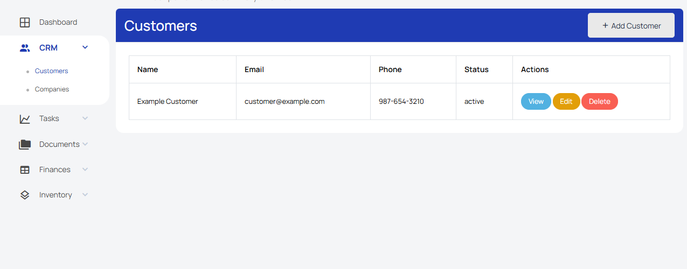
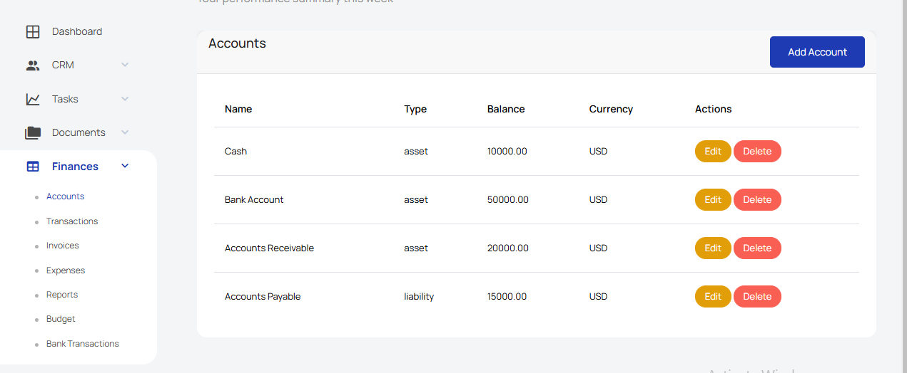
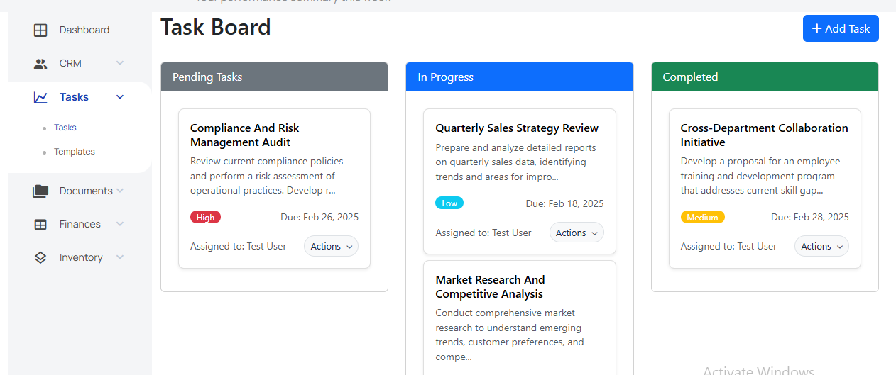
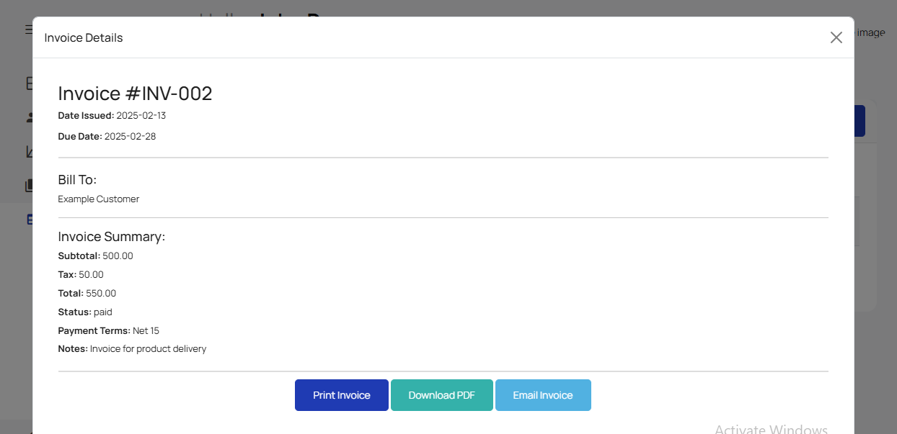
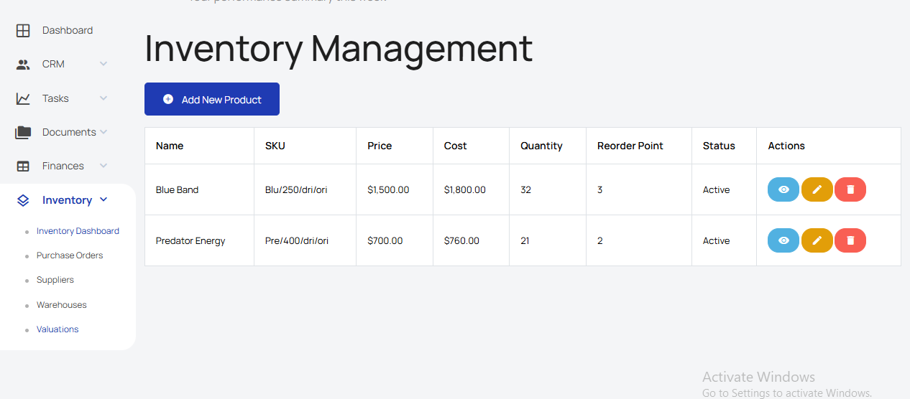

# Business Management Software

A powerful, all-in-one web application built with **Laravel 11** to simplify and unify business operations. This project integrates essential functions like CRM, financial management, inventory tracking, HR, and project management into a seamless, scalable system.

---

## Table of Contents

- [Overview](#overview)
- [Key Features](#key-features)
- [System Architecture](#system-architecture)
- [Core Modules](#core-modules)
  - [Financial Management](#financial-management)
  - [Inventory Management](#inventory-management)
- [Installation](#installation)
- [Usage](#usage)
- [Development Insights](#development-insights)
- [Roadmap](#roadmap)
- [Contributing](#contributing)
- [License](#license)

---

## Overview

The **Business Management Software** is a comprehensive solution designed to empower businesses by centralizing critical operations. Built on **Laravel 11** with **PHP 8.2+**, it combines a robust back-end with a modern, responsive front-end using **Bootstrap 5** and **Chart.js**. Whether you’re tracking finances, managing inventory, or overseeing projects, this application provides an intuitive, integrated experience.

---

## Key Features

- **CRM & Dashboard:** Role-based access (Admin, Manager, Employee), real-time notifications, and dynamic, data-driven dashboards.

- **Financial Management:**  
  - Multi-currency invoicing with real-time conversion.  
  - Bank transaction syncing (manual or automated).  
  - Budget planning with variance tracking.  
- **Inventory Management:**  
  - Product tracking with SKU, barcode, and stock levels.  
  - Multi-warehouse support and real-time transaction logging.  
  - Purchase orders, supplier management, and low-stock alerts.  
- **Scalable Modules:** Future-ready for HR, project management, and business intelligence.

 

 

 
---

## System Architecture

The application follows a **modular, service-oriented architecture** for flexibility and maintainability:

- **Database:** Managed via Laravel migrations for schema consistency.  
- **Models:** Represent core entities (e.g., `Invoice`, `Product`, `Budget`).  
- **Controllers:** Handle requests, validation, and responses.  
- **Services:** Abstract complex logic (e.g., `CurrencyConversionService`, `BankIntegrationService`).  
- **Views:** Responsive Blade templates with Bootstrap 5 and modal-based CRUD operations.  
- **Routes:** RESTful, prefixed for clarity (e.g., `/finance/`, `/inventory/`).  

---

## Core Modules

### Financial Management

#### Invoices & Multi-Currency Support
- **Database:** Tracks invoices with a `currency` field (e.g., USD, EUR).  
- **Features:** Create invoices in multiple currencies, with automatic conversion to a base currency for unified reporting.  
- **Screenshot:**  
    
  *Caption: Creating an invoice with multi-currency support.*

#### Bank Account Integration
- **Database:** Stores `bank_transactions` with fields like `amount` and `transaction_date`.  
- **Features:** Sync transactions manually via a UI button or automate with an API (simulated or real).  

#### Budget Planning & Monitoring
- **Database:** Manages budgets with `allocated` and `actual` fields, calculating variance dynamically.  
- **Features:** Modal-driven CRUD operations for seamless budget management.  
- **Screenshot:**  
    
  *Caption: Viewing budget details and variance in the dashboard.*

### Inventory Management

- **Database:**  
  - `products`: SKU, barcode, price, quantity, reorder point.  
  - `inventory_transactions`: Logs stock movements with warehouse linking.  
  - `warehouses`, `suppliers`, `purchase_orders`: Support extended functionality.  
- **Features:**  
  - Real-time stock updates from transactions.  
  - Purchase order creation and supplier tracking.  
  - Barcode/QR integration and low-stock notifications.  
- **Screenshot:**  
    
  *Caption: Managing products and stock levels in the inventory module.*

---

## Installation

### Prerequisites
- **PHP 8.2+**  
- **Laravel 11.x**  
- **Composer**  
- **Node.js & NPM** (for front-end assets)  
- **Database**: MySQL, 

### Setup Steps
1. **Clone the Repository:**  
   ```bash
   git clone https://github.com/kibali-cell/business.git
   cd business
   ```

2. **Install Dependencies:**  
   ```bash
   composer install
   npm install
   npm run dev
   ```

3. **Configure Environment:**  
   - Duplicate `.env.example` to `.env`:  
     ```bash
     cp .env.example .env
     ```
   - Update `.env` with your database and app settings.

4. **Generate App Key:**  
   ```bash
   php artisan key:generate
   ```

5. **Run Migrations:**  
   ```bash
   php artisan migrate --seed
   ```

6. **Launch Server:**  
   ```bash
   php artisan serve
   ```

---

## Usage

- **Financial Dashboard:** Visit `/finance/reports/dashboard` for revenue, expenses, and profit insights.  
- **Invoices:** Manage at `/finance/invoices` with currency selection.  
- **Bank Transactions:** Sync and view at `/finance/bank-transactions`.  
- **Budgets:** Create and track at `/finance/budgets` using modals.  
- **Inventory:** Access `/inventory` for product and stock management, `/purchase-orders` for orders, and `/suppliers` for supplier details.

---

## Development Insights

- **Modularity:** Each module is self-contained for easy updates or expansion.  
- **Services:** Reusable logic (e.g., currency conversion) is abstracted into services.  
- **UI/UX:** Bootstrap 5 ensures responsiveness; modals enhance interactivity.  
- **Testing:** Start with `php artisan serve` and explore endpoints. Add unit/feature tests as needed.

---


## Contributing

We welcome contributions! To get started:  
1. Fork the repo.  
2. Create a feature branch (`git checkout -b feature/your-idea`).  
3. Commit changes (`git commit -m "Add feature"`).  
4. Push to your fork (`git push origin feature/your-idea`).  
5. Open a pull request.  

For major changes, please open an issue first to discuss your proposal.

---

## License

Licensed under the [MIT License](LICENSE).

---